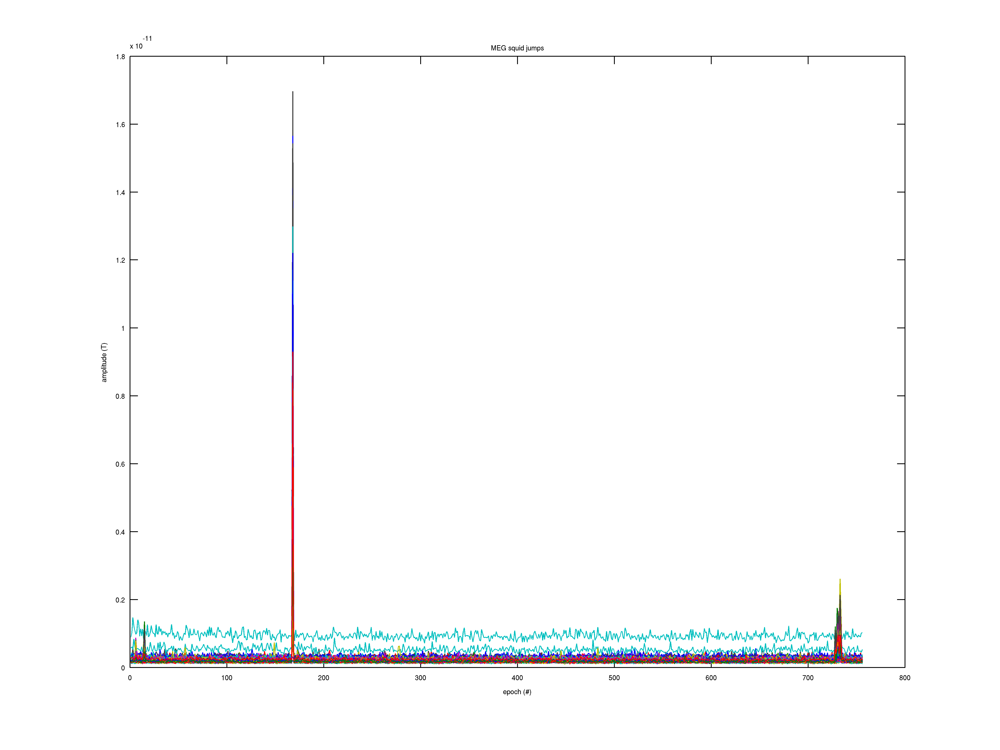
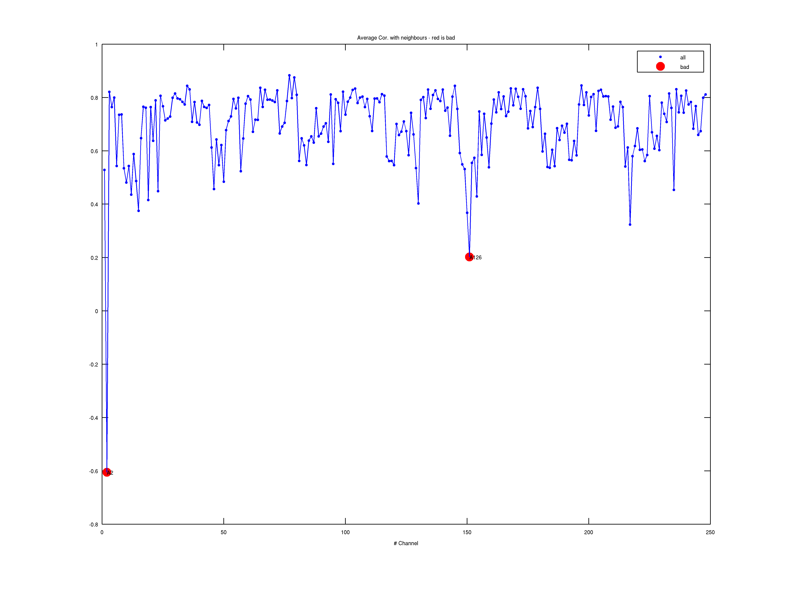

## A Complete Investigation of the HCP MEG Preprocessing Pipeline (Subject 100307)
#### 1. Raw Data Structure
The HCP data is recorded from a MEG system called BTi and later renamed to 4D-Neuroimaging. The company is broke but the system is still running. A BTi/4D dataset directory is different from the exported data. The exported data usually look like this:
* c,rfDC
* e,rfhp1.0Hz
* hc,rfDC
* e,rfhp1.0Hz,COH

The letters before the first comma refer to the recording mode: e for epoched data, c for continuously recorded data, or hc for continuously recorded data with the coils in continuous headmotiontracking mode. The rfXXXX part refers to the hardware filter settings, rfDC meaning no filtering at all, and rfhp1.0Hz means that a 1.0 Hz cutoff high pass filter was applied prior to the digitization of the data. COH (or COH1) refer to the short recording to obtain the positions of the Coils On Head.

Usually a hs_file is available containing a list of coordinates in 3D-space, describing the participants headshape - however, in this case I wasn't able to find it in anywhere. Maybe in the anatomy folder?

1. header file 
    - ft_read_header(c.rfDC) - read the header information that contains the following information from the c.rfDC file: 
        - Fs - sampling frequency
        - nChans - number of channels
        - nSamples - number of samples per trial
        - nSamplesPre - number of pre-trigger samples in each trial?
        - nTrials - number of trials
        - Label - Nx1 cell-array with the label of each channel
        - Chantype - Nx1 cell-array with the channel type, see FT_CHANTYPE
        - Chanunit - Nx1 cell-array with the physical units, see FT_CHANUNIT
        - Some has hdr.orig
        - For continuously recorded data, this will return nSamplesPre = 0 and nTrials = 1

2. events 
    - ft_read_event(c.rfDC) - also read from the c.rfDC file - reads all events from EEG/MEG and return a data structure:
        - event.type
        - event.sample
        - event.value
        - event.offset
        - event. duration
        - event.timestamp
        - might not be found in this dataset

3. electrodes and headshape
    - ft_prepare_layout(cfg=4D248) - readin the electrode sensors info from 4D248.m from the /template folder of in the pipeline.
    - ft_read_headshape(hsname) - readin the hs_file to define the shape of the head in the machine - however, wasn't able to locate the hs_file in the dataset.

headshape visualization:


#### Data Check

The datacheck pipeline break the data into snippets of 1024 samples, and they are consider trials of the dataset. The last trial with less than 1024 samples are discard and did not consider in the analysis.

There are six different configurations for the fieldtrip preprocessing pipeline:

* define the cfg parameter for the preprocessing module

```
%%===> This can load the data and before doing anything.
cfg = [];
cfg.datafile = filename;
cfg.feedback = 'none';
cfg.trl = ...
cfg.channel = ...
tmpdata = ft_preprocessing(cfg); 
```

* [Use multitapering for the time-frequency plots](./datacheck/100307_MEG_3-Restin_datacheck_MEG_powspctrm.png)

```
cfgf = [];
cfgf.method = 'mtmfft'; % multitaper/single taper FFT on the entire signal
cfgf.output = 'pow';
cfgf.taper = 'hanning'; % hanning taper - this case it is single taperiing
cfgf.feedback = 'none';
%%===> use the cfgf definition for time-frequency analysis
tmpfreq = ft_freqanalysis(cfgf, tmpdata);
```


* [Calculating the variabnce of the low frequency (<2 Hz) (amplitude)](./datacheck/100307_MEG_3-Restin_datacheck_MEG_lowfreq_power.png)

```
cfg4 = [];
cfg4.lpfilter = 'yes';
cfg4.lpfreq = 2;
cfg4.feedback = 'none';
%%===> low-pass data to < 2Hz using cfg4 on tmpdata
tmp = ft_preprocessing(cfg4, tmpdata)
...
%%===> calculate the variance of each trial, over the channels or time points (I am more tend to time points) - time points confirmed
%%===> and add this to a data structure.
for m = 1:numel(tmp.trial)
	tmptrace0 = cat(2, tmptrace0, var(tmp.trial{m},[],2))
end
```


*epoch (#) is the number of trials. Power is the variance of snippets of 1024 samples

* [line noise power](./datacheck/100307_MEG_3-Restin_datacheck_MEG_powerline_noise.png)

```
cfg2 = [];
cfg2.dftfilter = "yes";
cfg2.dftfreq = lfreq + [-1 0 1].*(hdr.Fs./1024); % using 60Hz as the line noise detection
% hdr.Fs - 2034 / 1024? why?
cfg2.feedback = "none";
cfg2.dftinvert = "yes";
cfg2.rectify = "yes"; % a shift in the spectrum towards lower frequency
cfg2.boxcar = 0.2; % handling the edge effect
% cfg2 seems like we didn't use it for anything 
```


* [SQUID (superconducting quantum interference device) jumps](./datacheck/100307_MEG_3-Restin_datacheck_jumps.png)

```
% Apply a median filter 
cfg3 = [];
cfg3.absdiff = 'yes';
cfg3.medianfilter = 'yes'; % absolute derivatives (first derivative then rectify)
cfg3.medianfiltored = 9; % length of the median filter
cfg3.feedback = 'none'; 
% find the maximum over the time course?

...
for m=1:numel(tmp.trial)
	tmptrace1 = cat(2, tmptrace1, max(tmp.trial{m},[],2));
end
```


* [power spectrun of reference channel](./datacheck/100307_MEG_3-Restin_datacheck_MEGREF_powspctrm.png)


* [neighbor channel correlation](./datacheck/100307_MEG_3-Restin_datacheck_neighb_correlation.png)


* [ECG](./datacheck/100307_MEG_3-Restin_datacheck_elecchan_ECG.png)
* [HEOG](./datacheck/100307_MEG_3-Restin_datacheck_elecchan_HEOG.png)
* [VEOG](./datacheck/100307_MEG_3-Restin_datacheck_elecchan_VEOG.png)
* [responses and events](./datacheck/100307_MEG_3-Restin_datacheck_triggers.png)

#### 2. Detecting bad channels

* [Average correlation with neighbors](./badchannel/100307_MEG_3-Restin_baddata_badchan_cor_scatter.png)




* [Standard deviation](./badchannel/100307_MEG_3-Restin_baddata_badchan_cor_topo.png)

